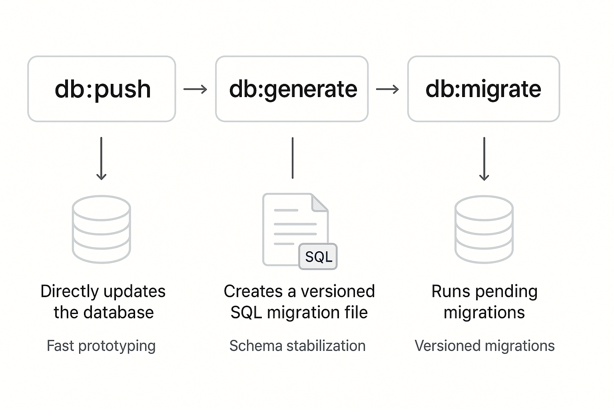

# Autopilot Interview

A 60-minute coding exercise to evaluate full-stack TypeScript development skills.

## Tech Stack

- **Backend:** Express + tRPC + Drizzle ORM + PostgreSQL
- **Frontend:** React + React Router v7 + tRPC Client
- **Build:** TypeScript strict mode + Biome + Vitest

## Prerequisites

- Node.js 24+
- Docker (for PostgreSQL)
- [mise](https://mise.jdx.dev/) (task runner)

## Quick Start

```bash
# 1. Install dependencies
mise setup

# 2. Start services and seed database
mise reset

# 3. Start development
mise dev
```

## Project Structure

```
interview/
├── api/                   # Backend API
│   ├── routes/v1+/        # OpenAPI routes (external API)
│   ├── trpc/              # tRPC routers (dashboard)
│   ├── services/          # Business logic
│   └── databases/         # Drizzle schema
│
├── dashboard/             # React SPA
│   └── app/routes/        # Pages
│
└── assets/components/ui/  # Shared UI components
```

## Available Commands

| Command | Description |
|---------|-------------|
| `mise setup` | Install dependencies |
| `mise reset` | Reset development environment |
| `mise dev` | Start API + dashboard in watch mode |
| `mise check` | Type check + lint |
| `mise test` | Run tests |
| `mise clean` | Clean node_modules and logs |
| `mise api <cmd>` | Run API CLI commands |

### API CLI Commands

| Command | Description |
|---------|-------------|
| `mise api start` | Start API server |
| `mise api db:gen` | Generate SQL migration file |
| `mise api db:migrate` | Run pending SQL migrations |
| `mise api db:push` | Push schema changes |
| `mise api db:seed` | Seed database |

### Database Workflow



- **db:push** — Directly updates the database. Use during fast prototyping.
- **db:generate** — Creates a versioned SQL migration file. Use when schema is stable.
- **db:migrate** — Runs pending migrations. Use for versioned deployments.

## Authentication

**Dashboard (session-based):**
- Login at `http://localhost:3000/login`
- Test credentials: `test@example.com` / `password123`
- Session persists in browser cookies
- tRPC calls include session cookie automatically

**API (API key-based):**
- Include `X-Api-Key: <key>` header in requests
- API key shown after running `mise up` or `mise api db:seed`

## What You'll Build

During the interview, you'll implement features across the stack:
1. **Service layer** - Business logic functions
2. **OpenAPI route** - External API endpoint
3. **tRPC router** - Dashboard API
4. **React component** - User interface

Your interviewer will provide specific requirements at the start.

## Key Files to Know

| File | Purpose |
|------|---------|
| `api/services/payments.ts` | Service functions (your implementation) |
| `api/routes/v1+/payments+/index.ts` | OpenAPI route |
| `api/trpc/payments.ts` | tRPC router |
| `dashboard/app/routes/_layout.payments/route.tsx` | React page |

## Architecture Notes

### Auth Flow: OpenAPI vs tRPC

**OpenAPI routes (external API via API key):**
```typescript
// X-Api-Key header → middleware → ctx.apiKey
// ctx.apiKey.userId gives the user who owns the API key
// ctx.user is NULL (no session)
async handler({ ctx, response }) {
  if (!ctx.apiKey) {
    return response.unauthorized({ error: "API key required" });
  }
  const userId = ctx.apiKey.userId; // Use this!
}
```

**tRPC routes (dashboard via session):**
```typescript
// Session cookie → Better Auth → ctx.user
// ctx.user.id gives the logged-in user
// ctx.apiKey is NULL (no API key)
protectedProcedure.query(({ ctx }) => {
  const userId = ctx.userId; // Use this!
});
```

## Tips for Success

1. **Read existing code first** - Follow established patterns
2. **Get it working, then refine** - Don't over-engineer
3. **Ask questions** - Clarify requirements before coding
4. **Use TypeScript** - Let the compiler guide you
5. **Run `mise check` often** - Catch errors early

## Reference Examples

- OpenAPI pattern: `api/routes/v1+/payments+/$id+/index.ts` (GET endpoint)
- tRPC pattern: `api/trpc/init.ts`
- UI components: `assets/components/ui/`
